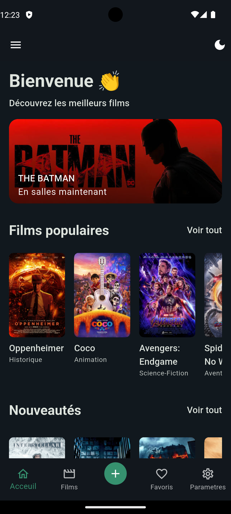
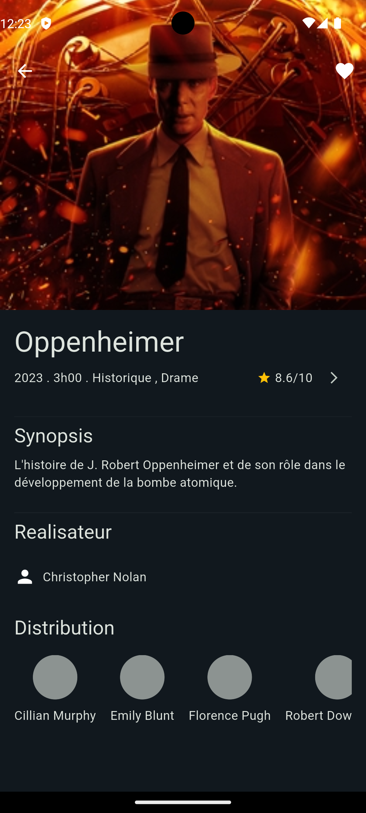
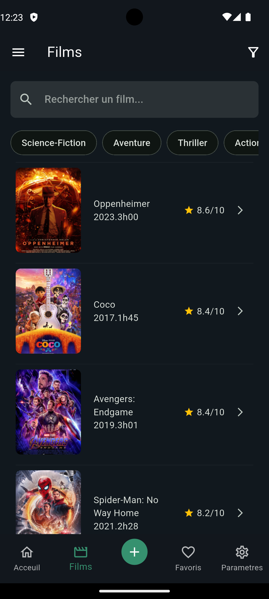
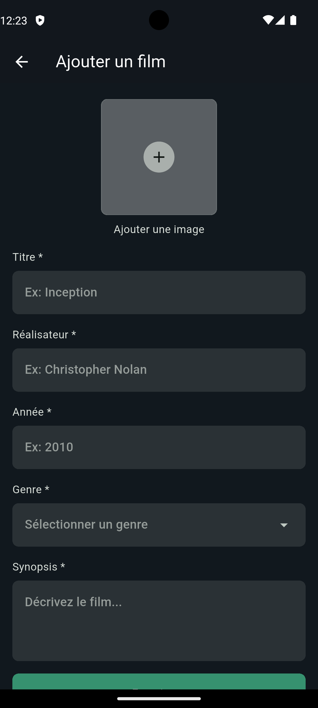
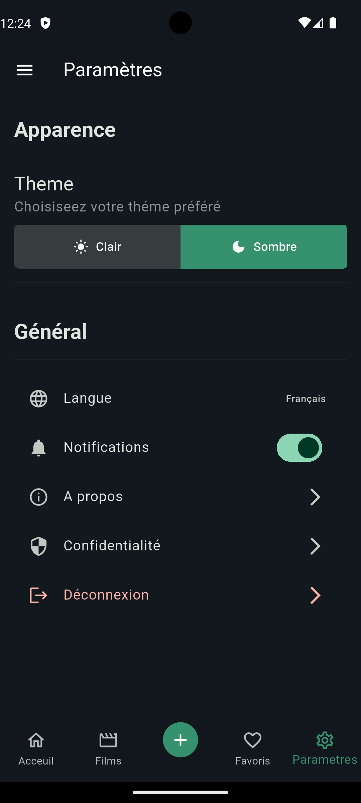
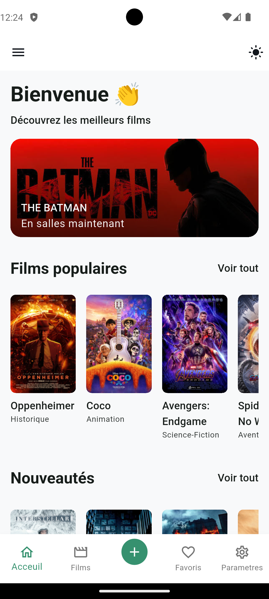
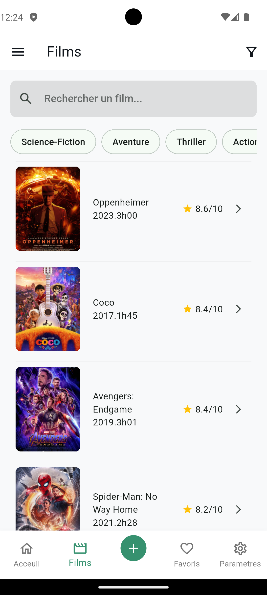
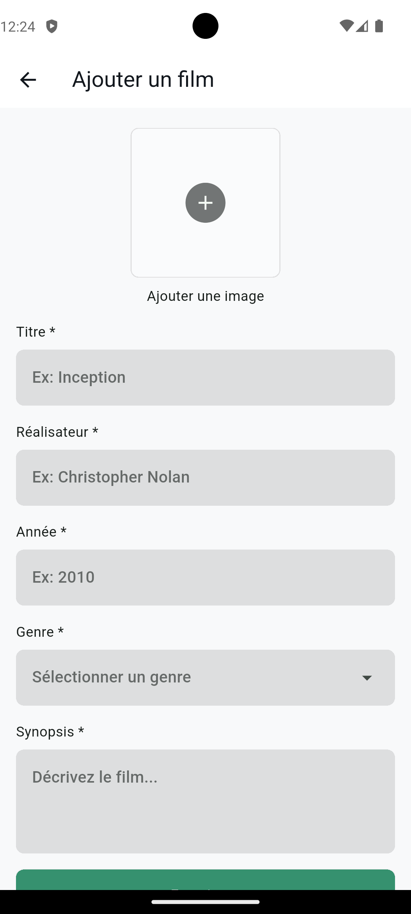
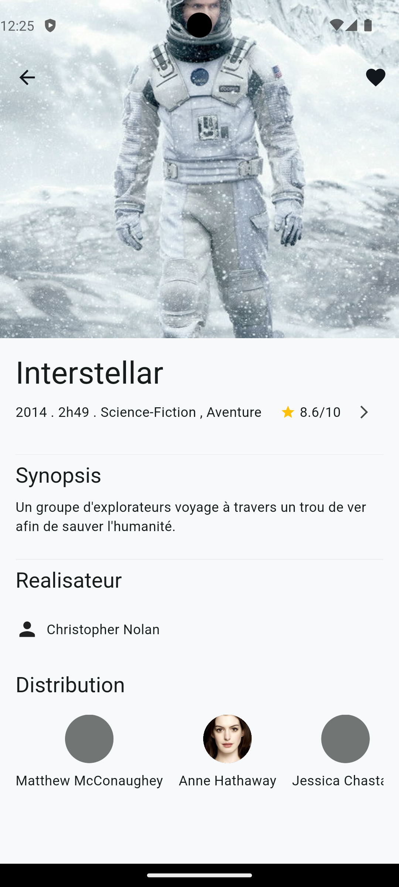
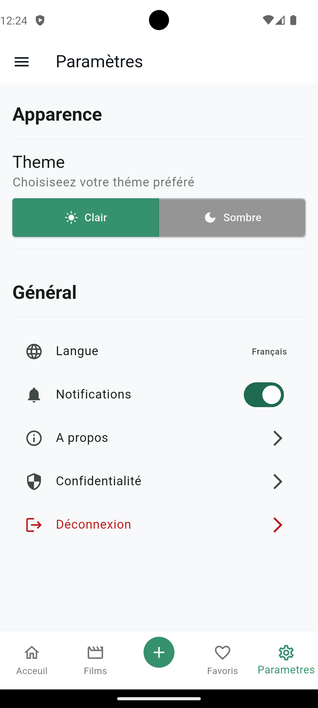

# Ciné App — Flutter Multi-Screen Movie App

A multi-screen mobile application built with **Flutter**, demonstrating navigation with GoRouter, reusable widget composition, form validation, and light/dark theme management.

The application lets users browse a movie catalog, search and filter titles, view detailed movie information, add new movies through a validated form, and switch between light and dark themes — all backed by a clean separation between UI and data.

---

# Features

- Browse featured and popular movies on the home screen
- Search and filter movies by genre
- View detailed movie information (synopsis, director, cast, rating)
- Add a new movie through a validated form
- Bottom navigation between Home, Movies, Add Movie, Favorites and Settings
- Light / dark theme toggle, applied app-wide
- Responsive layouts built with `LayoutBuilder`
- Reusable, data-driven widgets (no hardcoded UI content)

---

# Project Architecture

The project follows a **layered architecture**, where each layer has a single responsibility.

```
lib/
│
├── controller/
│   └── theme_controller.dart
│
├── datas/
│   └── movies.dart
│
├── models/
│   ├── movie.dart
│   ├── movie_actor.dart
│   └── movie_genre.dart
│
├── routes/
│   └── app_router.dart
│
├── screens/
│   ├── add_movie_screen.dart
│   ├── details_screen.dart
│   ├── home_screen.dart
│   ├── movies_screen.dart
│   └── setting_screen.dart
│
├── shared/
│   ├── constants/
│   │   ├── app_alpha.dart
│   │   ├── app_colors.dart
│   │   ├── app_radius.dart
│   │   └── app_sizes.dart
│   ├── extensions/
│   │   └── context_extensions.dart
│   └── themes/
│       └── app_theme.dart
│
├── widgets/
│   ├── custom_bottom_navigation.dart
│   ├── custom_elevated_button.dart
│   ├── custom_text_field.dart
│   ├── display_ranking.dart
│   ├── distribution_item.dart
│   ├── featured_movie.dart
│   ├── filters_widget.dart
│   ├── image_add_widget.dart
│   ├── movie_search_list_item.dart
│   ├── movie_widget_item.dart
│   ├── see_more_widget.dart
│   └── toggle_elevated_button.dart
│
├── skeleton.dart
└── main.dart
```

The application is organized so that each component has a clear responsibility, making the code easier to understand, maintain, and extend.

---

# Design Choices

## Object-Oriented Programming

The project follows Object-Oriented Programming and composition principles.

### Models

The `Movie`, `MovieActor` and `MovieGenre` classes define the data structures used throughout the app.
`Movie` centralizes JSON serialization (`fromJson` / `toJson`), keeping parsing logic out of the UI layer.

---

### Widget Composition & Reuse

Rather than relying on inheritance between screens, the app favors **composition**: common UI elements (buttons, text fields, list items, filters) are extracted into standalone widgets under `widgets/`.

Example:

```
Screens
   │
   ▼
Reusable Widgets  (CustomTextField, MovieWidgetItem, FiltersWidget, ...)
   │
   ▼
Shared Constants / Extensions  (AppColors, AppSizes, context.texte, ...)
```

This design allows new screens to be built quickly using existing, consistent building blocks.

---

### Routing

Navigation is handled by **GoRouter**, centralized in a single `app_router.dart` file.

```dart
final appRouter = GoRouter(
  initialLocation: '/',
  routes: [...],
);
```

Path parameters (e.g. `/movie/:id`) are used to pass data between the movie list and the details screen without relying on global state.

---

### Theme Management

The app theme is controlled through a single `ValueNotifier<ThemeMode>` exposed by `theme_controller.dart`, and consumed at the root of the widget tree via `ValueListenableBuilder`. This keeps theme state minimal, reactive, and decoupled from individual screens.

---

# Data Handling

Movies, genres and actors are defined as static data inside `datas/movies.dart`, using the app's models rather than raw maps or hardcoded widget content.

When the application starts:
1. Static data is loaded from `datas/movies.dart`.
2. Screens consume this data through their models (`Movie`, `MovieGenre`, `MovieActor`).
3. Widgets remain purely presentational — they receive data as parameters instead of embedding it.

This approach keeps the UI layer free of hardcoded content and easy to later connect to a real data source (API, database, local storage).

---

# Application Workflow

```
User
  │
  ▼
Screens (Home, Movies, Details, AddMovie, Settings)
  │
  ▼
Reusable Widgets
  │
  ▼
Models (Movie, MovieGenre, MovieActor)
  │
  ▼
Static Data (datas/movies.dart)
```

Each layer communicates only with the layer directly below it, improving readability and maintainability.

---

# Technologies

- Flutter
- Dart
- go_router
- uuid
- Material 3

---

# Installation

Clone the repository:

```bash
git clone <repository-url>
```

Move into the project:

```bash
cd movie_app
```

Install dependencies:

```bash
flutter pub get
```

---

# Running the Application

Start the app on a connected device or emulator:

```bash
flutter run
```

---

# Author

This project was developed as part of a Flutter multi-screen certification project to demonstrate proficiency in:

- Flutter widgets & layouts
- Navigation with GoRouter
- Form validation
- State management with ValueNotifier
- Light/dark theme handling
- UI / data separation
  
# Screens  









